# System Architecture Diagrams - River Level Monitoring WSN

This document provides comprehensive architecture diagrams for the complete river level monitoring system, including all components from sensor nodes to data visualization.

## Table of Contents

1. [System Overview](#system-overview)
2. [Data Flow Diagram](#data-flow-diagram)
3. [Component Architecture](#component-architecture)
4. [Network Topology](#network-topology)
5. [Deployment Architecture](#deployment-architecture)
6. [Technology Stack](#technology-stack)

---

## System Overview

### High-Level Architecture

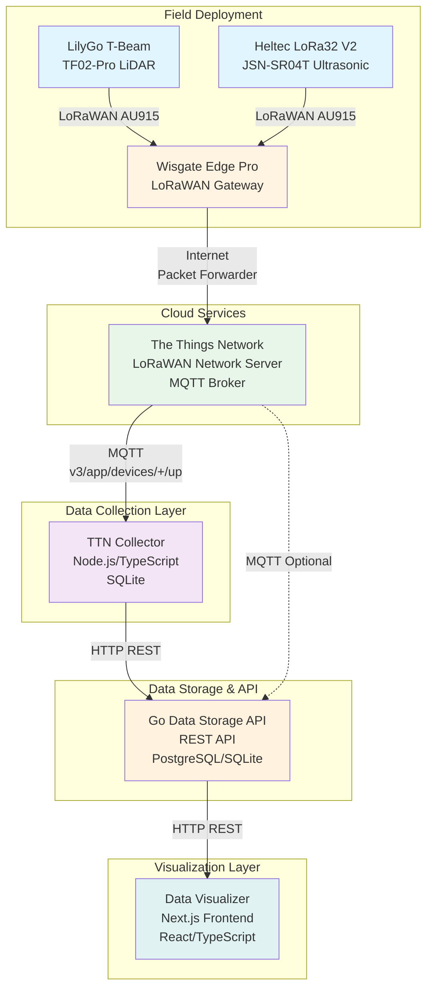

---

## Data Flow Diagram

### Complete Data Flow from Sensor to Visualization

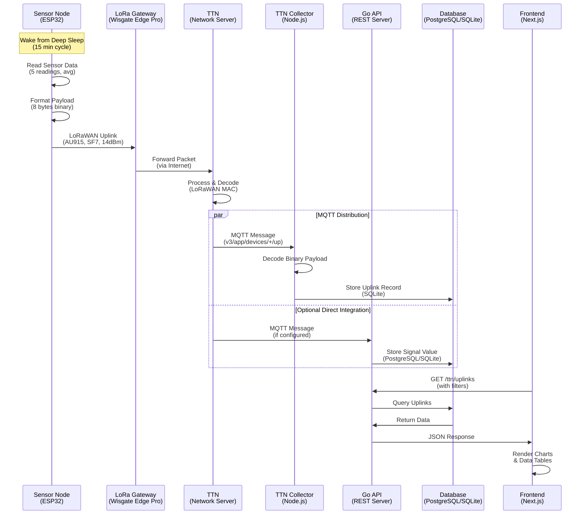

---

## Component Architecture

### 1. Sensor Node Architecture (LilyGo T-Beam)

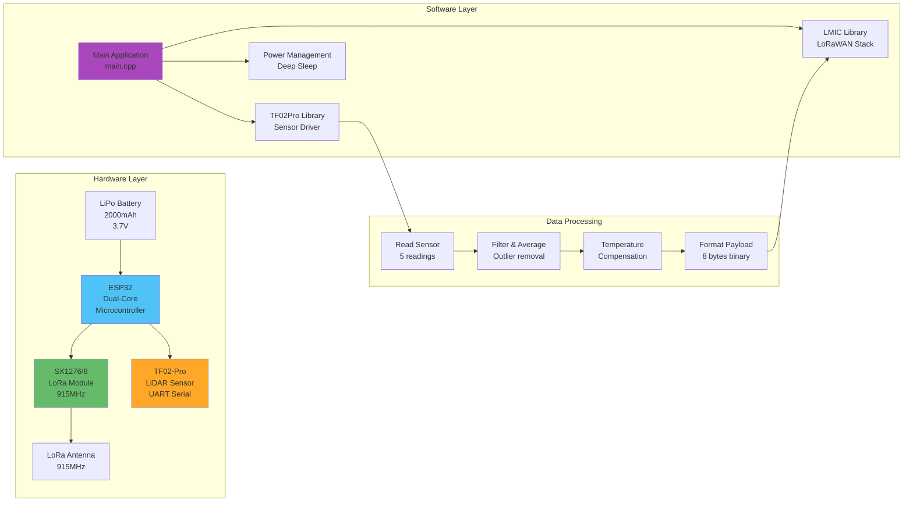

### 2. TTN Collector Architecture

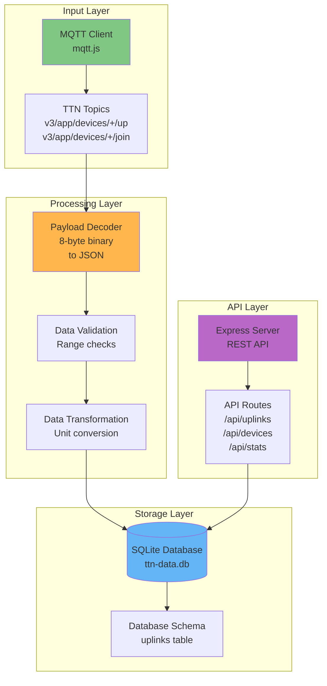

### 3. Go Data Storage API Architecture

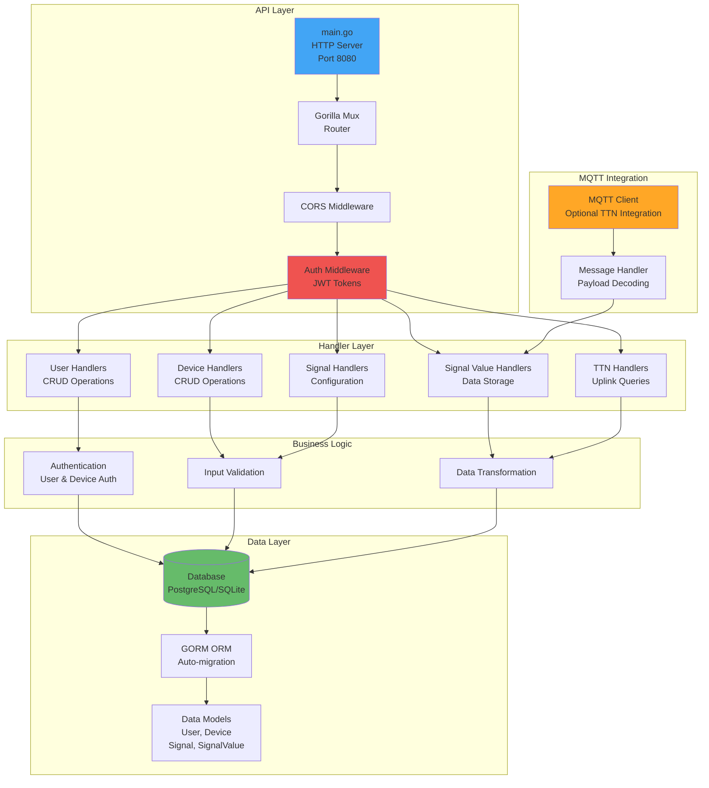

### 4. Data Visualizer Architecture

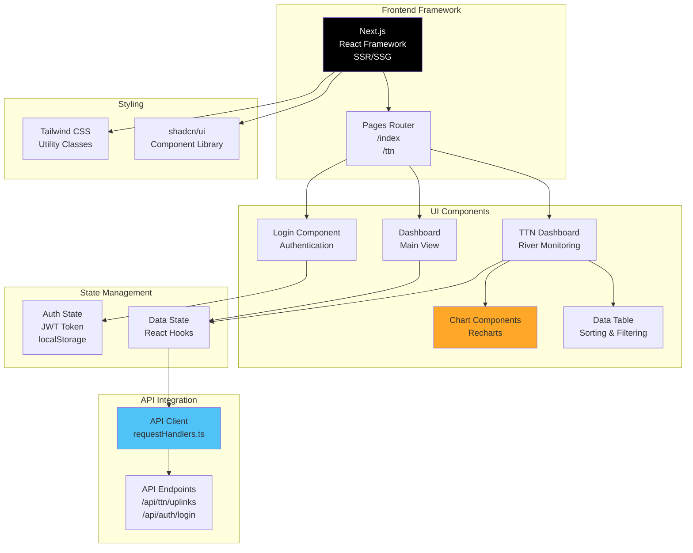

---

## Network Topology

### Physical Network Layout

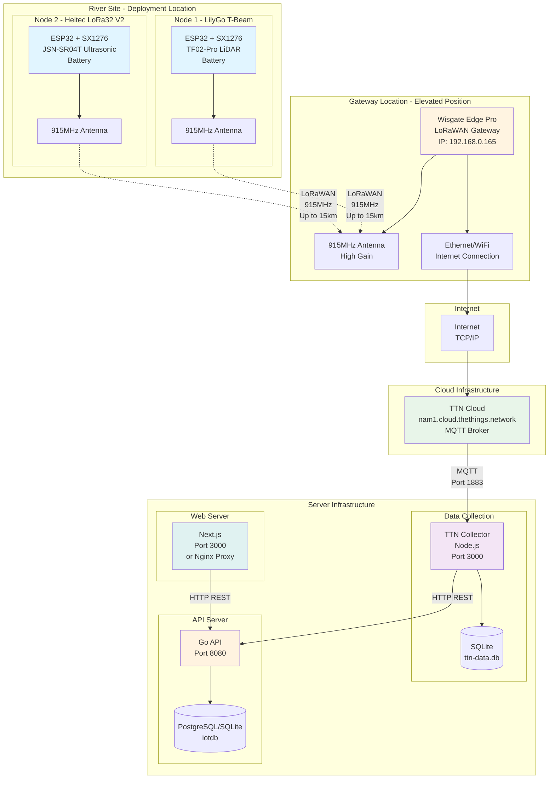

---

## Deployment Architecture

### Docker Compose Deployment

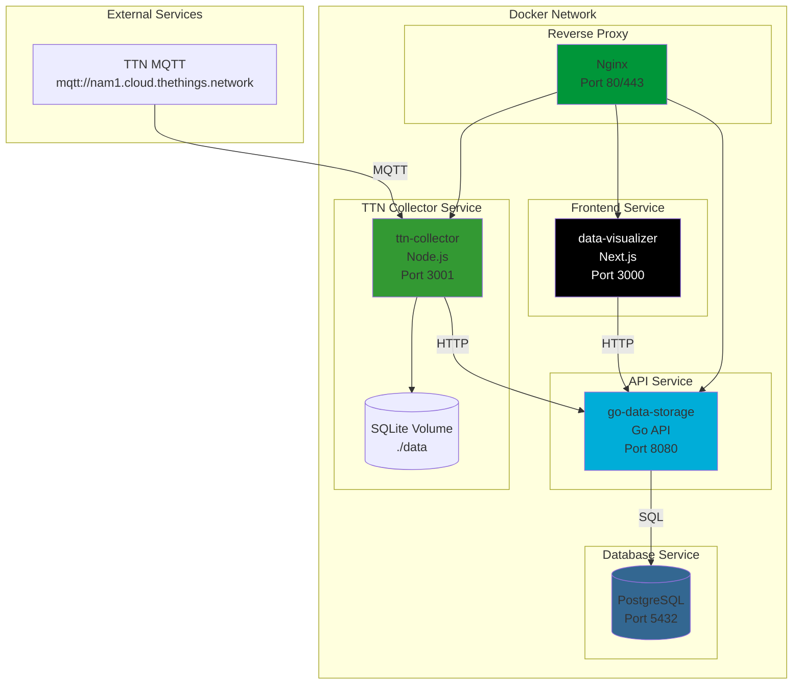

---

## Technology Stack

### Complete Technology Stack Diagram

```mermaid
graph LR
    subgraph "Hardware"
        H1[ESP32<br/>Microcontroller]
        H2[SX1276/8<br/>LoRa Radio]
        H3[TF02-Pro<br/>LiDAR Sensor]
        H4[JSN-SR04T<br/>Ultrasonic]
        H5[Wisgate Edge Pro<br/>Gateway]
    end
    
    subgraph "Firmware"
        F1[Arduino Framework<br/>C++]
        F2[LMIC Library<br/>LoRaWAN Stack]
        F3[PlatformIO<br/>Build System]
    end
    
    subgraph "Network"
        N1[LoRaWAN<br/>AU915 Band]
        N2[TTN<br/>Network Server]
        N3[MQTT<br/>Message Broker]
    end
    
    subgraph "Backend"
        B1[Node.js<br/>TypeScript]
        B2[Go<br/>Golang]
        B3[Express.js<br/>Web Framework]
        B4[Gorilla Mux<br/>HTTP Router]
    end
    
    subgraph "Database"
        D1[SQLite<br/>Embedded DB]
        D2[PostgreSQL<br/>Relational DB]
        D3[GORM<br/>ORM Library]
    end
    
    subgraph "Frontend"
        FE1[Next.js<br/>React Framework]
        FE2[TypeScript<br/>Type Safety]
        FE3[Recharts<br/>Chart Library]
        FE4[Tailwind CSS<br/>Styling]
        FE5[shadcn/ui<br/>Components]
    end
    
    subgraph "DevOps"
        DO1[Docker<br/>Containerization]
        DO2[Docker Compose<br/>Orchestration]
        DO3[Nginx<br/>Reverse Proxy]
    end
    
    H1 --> F1
    H2 --> F2
    F1 --> F3
    H3 --> F1
    H4 --> F1
    
    F2 --> N1
    N1 --> H5
    H5 --> N2
    N2 --> N3
    
    N3 --> B1
    B1 --> B3
    B3 --> D1
    B1 --> B2
    B2 --> B4
    B4 --> D2
    D2 --> D3
    
    FE1 --> FE2
    FE1 --> FE3
    FE1 --> FE4
    FE1 --> FE5
    FE1 --> B2
    
    DO1 --> DO2
    DO2 --> DO3
    DO3 --> FE1
    DO3 --> B2
    
    style H1 fill:#e1f5ff
    style F1 fill:#ff9800
    style N1 fill:#4caf50
    style B1 fill:#339933
    style B2 fill:#00add8
    style D1 fill:#003b57
    style D2 fill:#336791
    style FE1 fill:#000000,color:#fff
    style DO1 fill:#0db7ed
```

---

## Data Payload Structure

### 8-Byte Binary Payload Format

```mermaid
graph LR
    subgraph "Payload Structure (8 bytes)"
        B0[Byte 0<br/>Sensor Type<br/>uint8]
        B1[Byte 1-2<br/>Distance<br/>uint16 LE]
        B2[Byte 3-4<br/>Signal Strength<br/>int16 LE]
        B3[Byte 5<br/>Temperature<br/>int8]
        B4[Byte 6<br/>Battery %<br/>uint8]
        B5[Byte 7<br/>Reading Count<br/>uint8]
    end
    
    subgraph "Decoded Values"
        D0[1 = TF02-Pro<br/>3 = JSN-SR04T]
        D1[Distance in mm<br/>0-65535]
        D2[Signal flux<br/>or 0]
        D3[Temp in °C<br/>-128 to 127]
        D4[Battery 0-100%]
        D5[Valid readings<br/>typically 5]
    end
    
    B0 --> D0
    B1 --> D1
    B2 --> D2
    B3 --> D3
    B4 --> D4
    B5 --> D5
    
    style B0 fill:#ff9800
    style B1 fill:#4caf50
    style B2 fill:#2196f3
    style B3 fill:#f44336
    style B4 fill:#9c27b0
    style B5 fill:#00bcd4
```

---

## Component Interaction Diagram

### Detailed Component Interactions

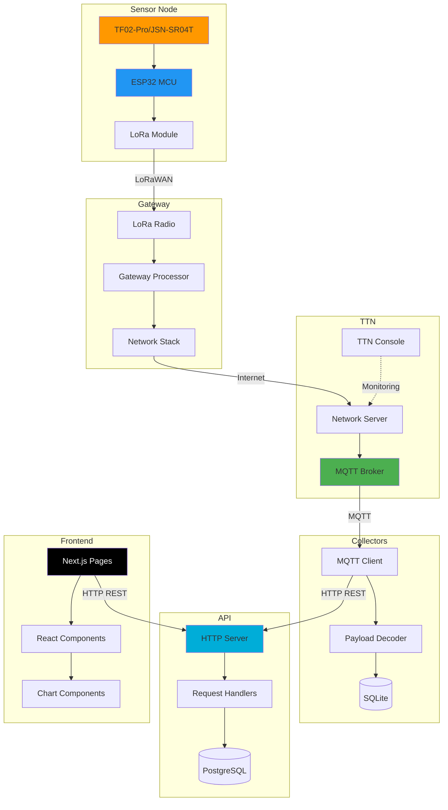

---

## Summary

This architecture provides:

1. **Scalable Sensor Network**: Multiple LoRaWAN nodes with different sensor types
2. **Reliable Data Collection**: TTN network server with MQTT-based data collection
3. **Flexible Storage**: Multiple storage options (SQLite, PostgreSQL)
4. **RESTful API**: Go-based API with authentication and device management
5. **Modern Frontend**: Next.js dashboard with real-time visualization
6. **Containerized Deployment**: Docker-based deployment for easy scaling

### Key Features:

- **LoRaWAN Communication**: Long-range, low-power wireless communication
- **Multiple Sensor Support**: LiDAR and Ultrasonic sensors
- **Dual Data Collection**: Both TTN Collector and Go API can collect data
- **Real-time Visualization**: Interactive charts and data tables
- **Authentication**: JWT-based user and device authentication
- **RESTful Design**: Standard HTTP API for easy integration

### Data Flow Summary:

1. Sensors collect distance measurements every 15 minutes
2. Data is transmitted via LoRaWAN to gateway
3. Gateway forwards to TTN network server
4. TTN publishes data via MQTT
5. Collectors subscribe and store data
6. API provides REST endpoints for data access
7. Frontend visualizes data in real-time
