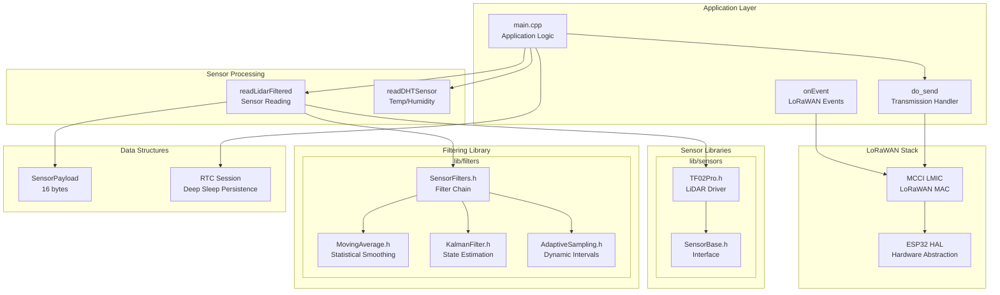
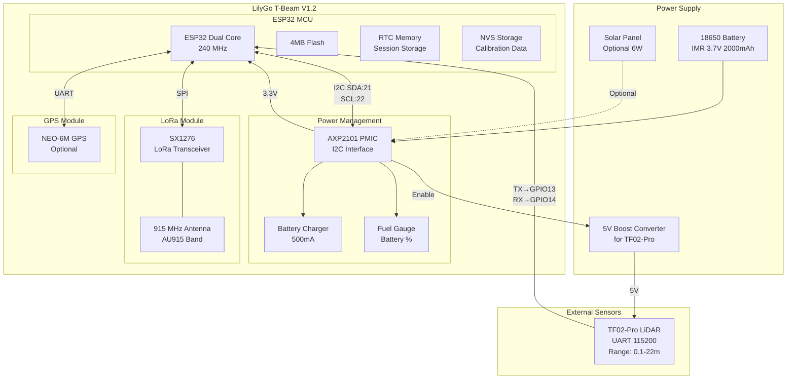
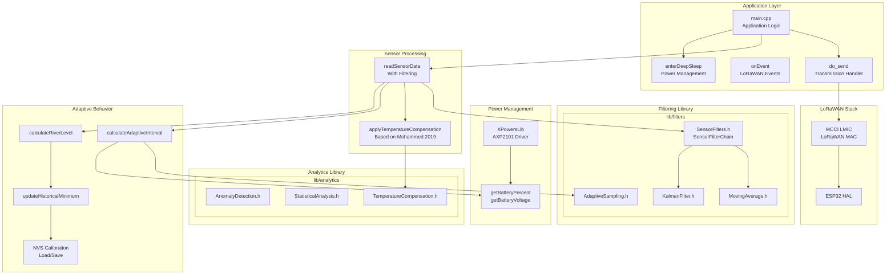
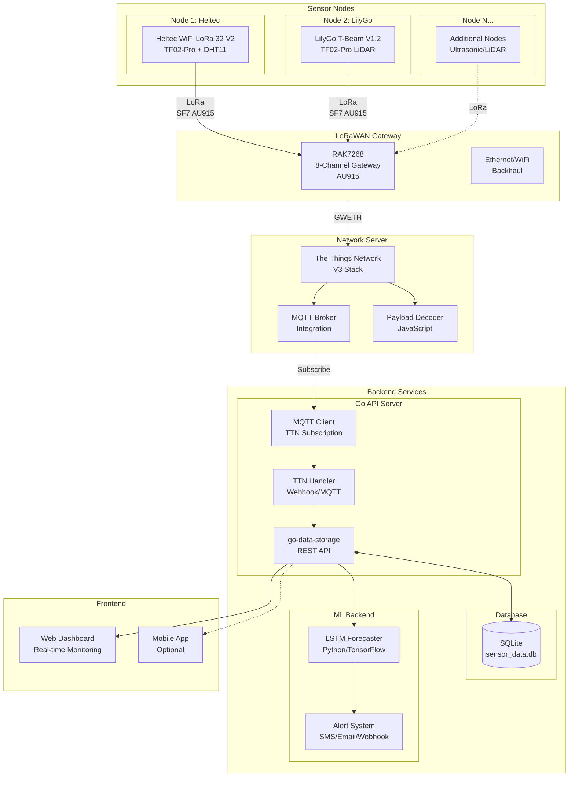
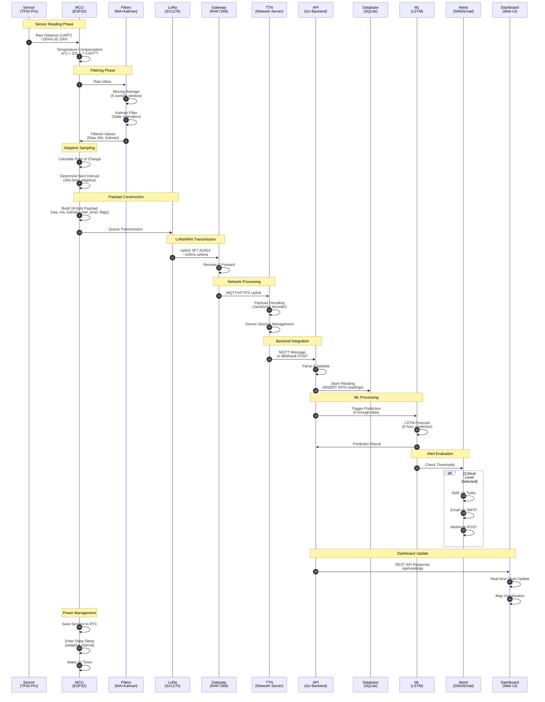
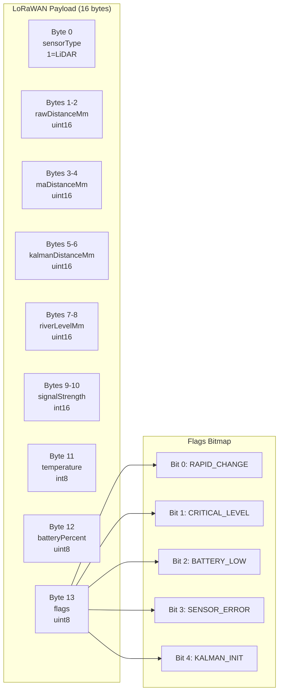
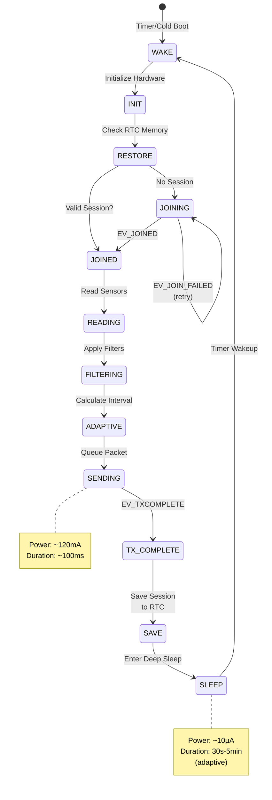
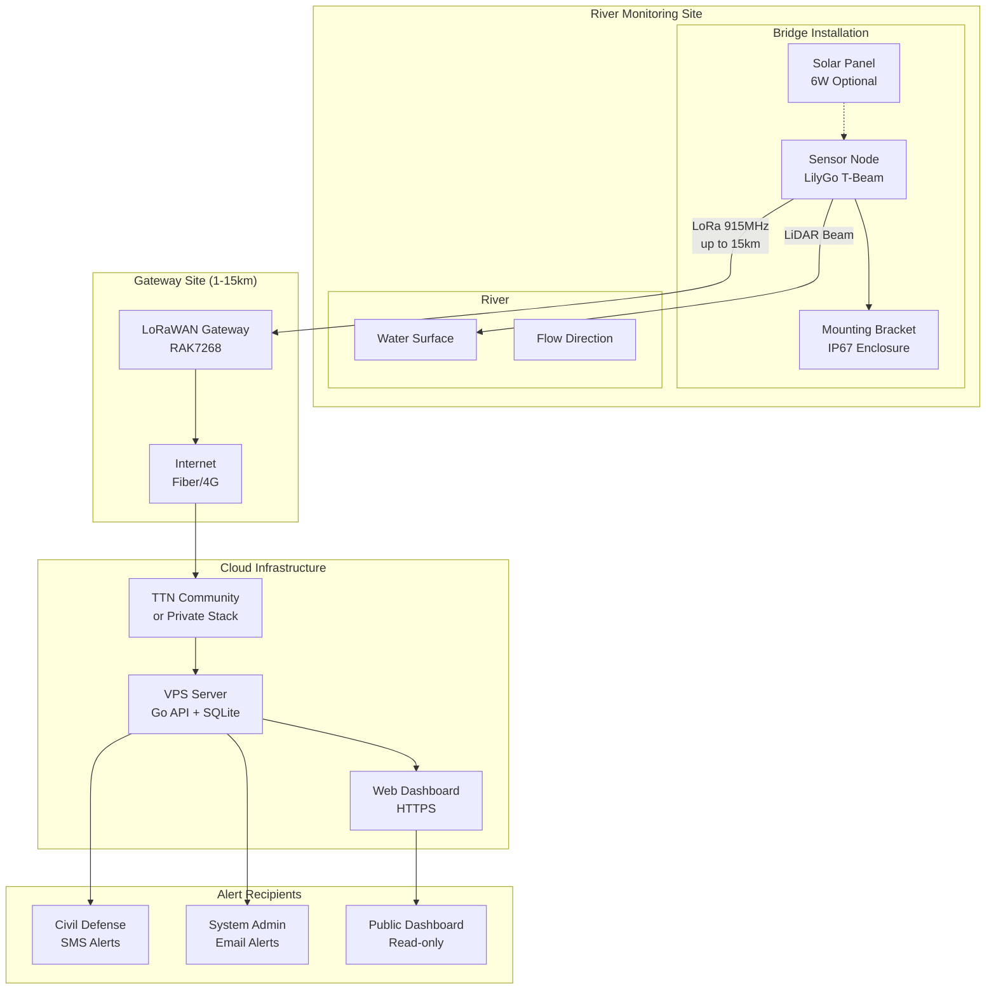

# River Level Monitoring WSN - Architecture Diagrams

## 1. Heltec Module - Hardware Architecture

```mermaid
graph TB
    subgraph "Heltec WiFi LoRa 32 V2"
        subgraph "ESP32 MCU"
            CPU[ESP32 Dual Core<br/>240 MHz]
            FLASH[4MB Flash]
            RTC[RTC Memory<br/>Session Storage]
        end

        subgraph "LoRa Module"
            SX1276[SX1276<br/>LoRa Transceiver]
            ANT[915 MHz Antenna<br/>AU915 Band]
        end

        subgraph "Display"
            OLED[0.96" OLED<br/>SSD1306<br/>128x64px]
        end

        subgraph "Power Management"
            BATT[Battery ADC<br/>GPIO 37]
            USB[USB-C<br/>5V Input]
        end
    end

    subgraph "External Sensors"
        TF02[TF02-Pro LiDAR<br/>UART 115200<br/>Range: 0.1-22m]
        DHT[DHT11<br/>Temp/Humidity]
    end

    subgraph "Power Supply"
        EXTBAT[External 5V Battery<br/>for TF02-Pro]
        LIPO[3.7V LiPo<br/>for ESP32]
    end

    TF02 -->|TX→GPIO13<br/>RX→GPIO17| CPU
    DHT -->|DATA→GPIO25| CPU
    CPU <-->|SPI| SX1276
    SX1276 --- ANT
    CPU <-->|I2C| OLED
    BATT --> CPU
    EXTBAT -->|5V| TF02
    LIPO --> USB
    USB --> CPU
```

## 2. Heltec Module - Software Architecture



## 3. LilyGo T-Beam - Hardware Architecture



## 4. LilyGo T-Beam - Software Architecture



## 5. Full WSN Architecture



## 6. Data Flow Timeline



## 7. Payload Structure



## 8. Filter Chain Processing

```mermaid
flowchart LR
    subgraph Input
        RAW[Raw Sensor<br/>Reading]
    end

    subgraph "Moving Average Filter"
        MA_BUF[Circular Buffer<br/>5 samples]
        MA_CALC[Sum / Count]
        MA_OUT[MA Value]
    end

    subgraph "Kalman Filter"
        PRED[Predict Step<br/>P = P + Q]
        UPD[Update Step<br/>K = P/(P+R)]
        EST[State Estimate<br/>x = x + K*innovation]
        KF_OUT[Kalman Value<br/>+ Uncertainty]
    end

    subgraph "Adaptive Sampler"
        RATE[Rate of Change<br/>cm/min]
        THRESH[Threshold Check<br/>5cm = rapid]
        INT[Interval Selection<br/>30s-5min]
    end

    subgraph Output
        RESULT[FilteredReading<br/>raw, ma, kalman<br/>uncertainty, interval]
    end

    RAW --> MA_BUF
    MA_BUF --> MA_CALC
    MA_CALC --> MA_OUT

    RAW --> PRED
    PRED --> UPD
    UPD --> EST
    EST --> KF_OUT

    KF_OUT --> RATE
    RATE --> THRESH
    THRESH --> INT

    MA_OUT --> RESULT
    KF_OUT --> RESULT
    INT --> RESULT
```

## 9. Deep Sleep Power Cycle



## 10. System Deployment


