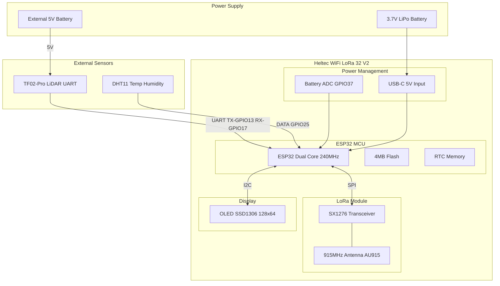
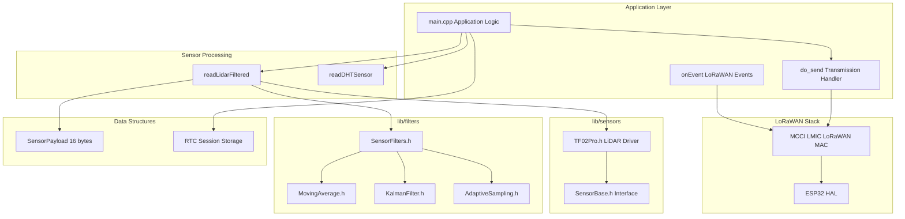
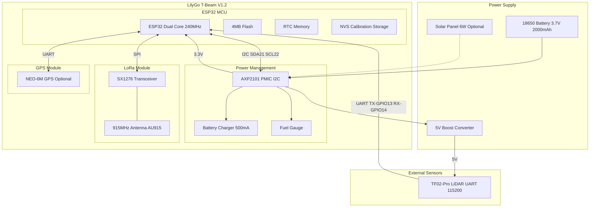
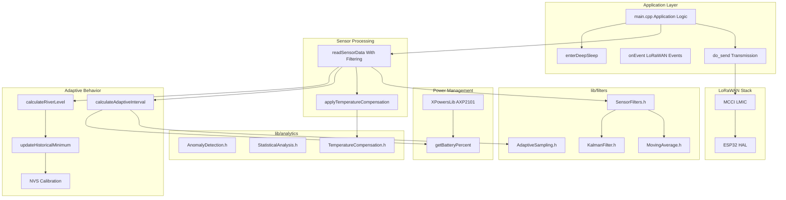
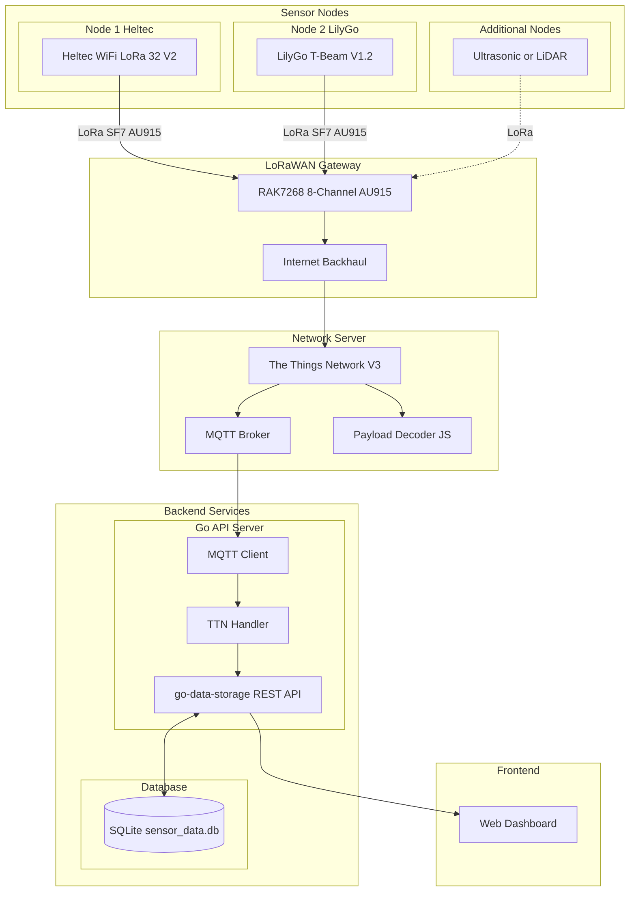
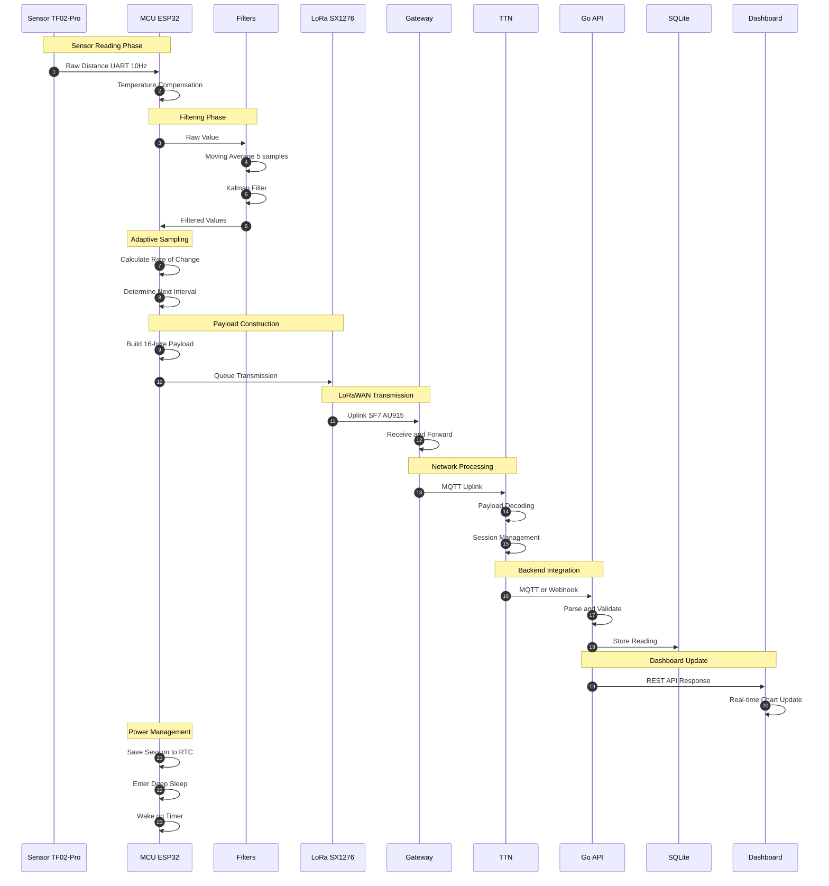
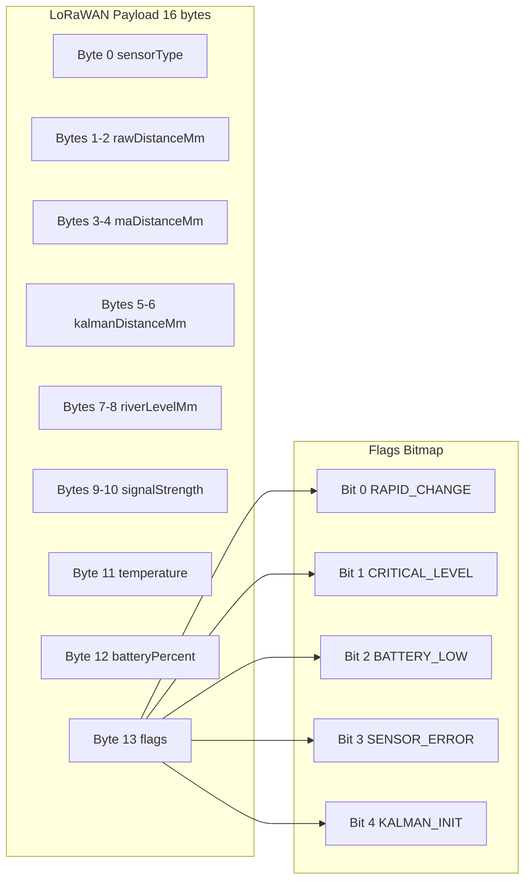
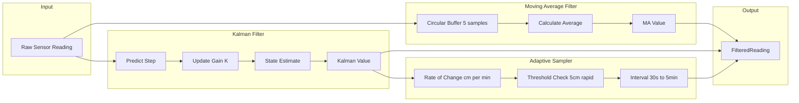
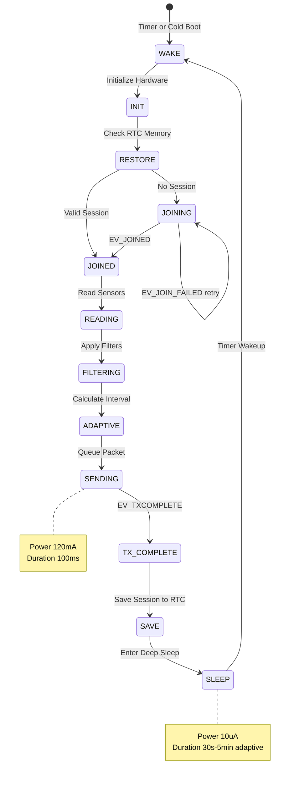
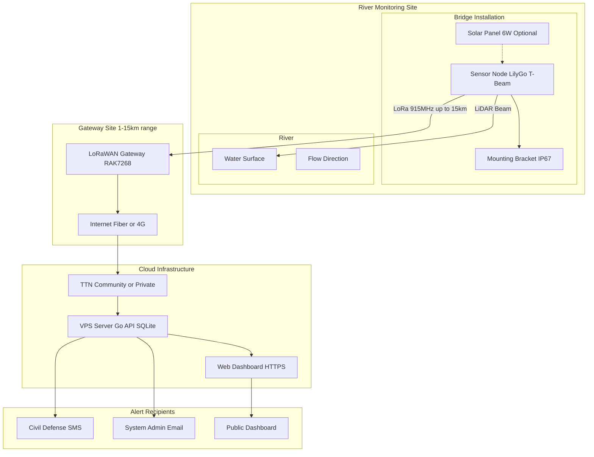

# River Level Monitoring WSN - Architecture Diagrams

## 1. Heltec Module - Hardware Architecture

## 2. Heltec Module - Software Architecture

## 3. LilyGo T-Beam - Hardware Architecture

## 4. LilyGo T-Beam - Software Architecture

## 5. Full WSN Architecture

## 6. Data Flow Timeline

## 7. Payload Structure

## 8. Filter Chain Processing

## 9. Deep Sleep Power Cycle

## 10. System Deployment

